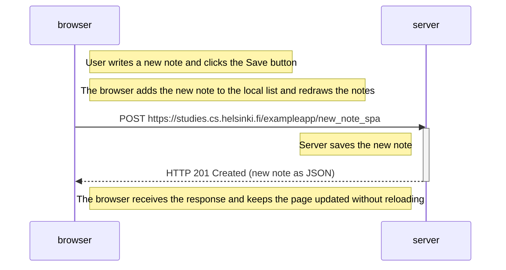

```mermaid
sequenceDiagram
    participant browser
    participant server

    Note right of browser: User writes a new note and clicks the Save button

    Note right of browser: The browser adds the new note to the local list and redraws the notes

    browser->>server: POST https://studies.cs.helsinki.fi/exampleapp/new_note_spa
    activate server
    Note left of server: Server saves the new note
    server-->>browser: HTTP 201 Created (new note as JSON)
    deactivate server

    Note right of browser: The browser receives the response and keeps the page updated without reloading
```